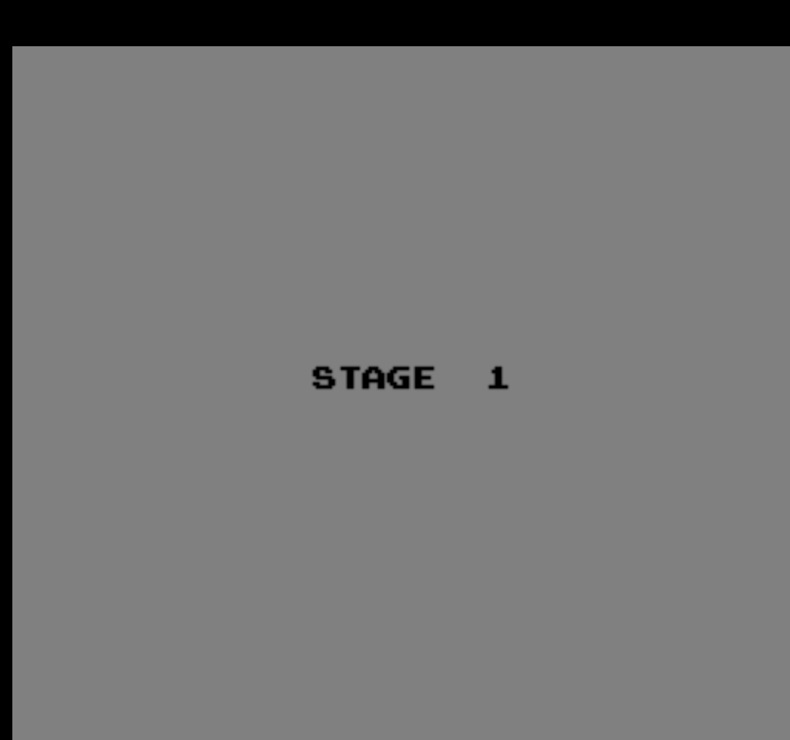
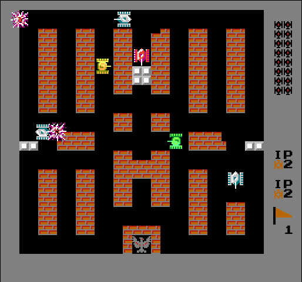
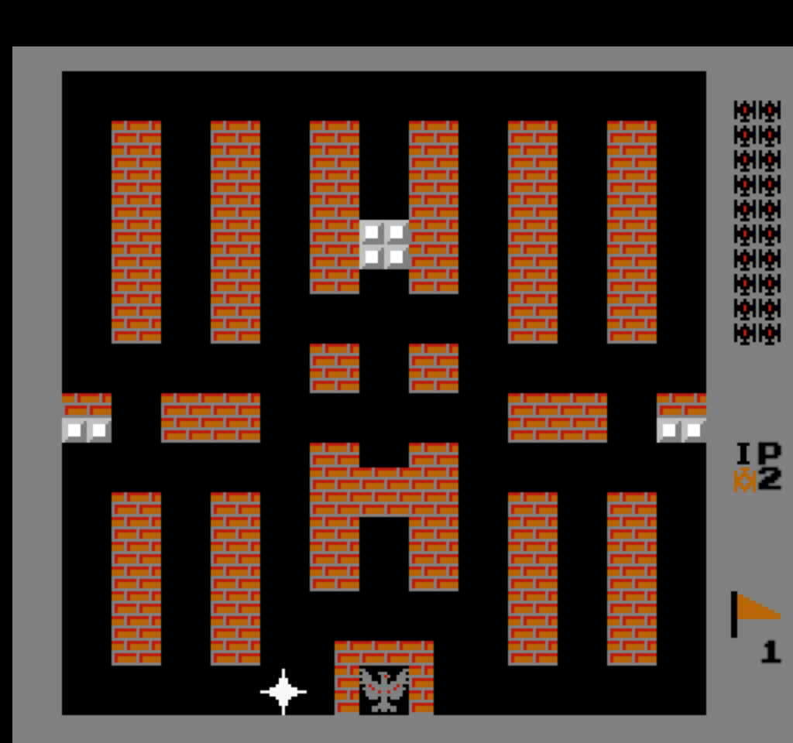

# Battle City

NES《坦克大战》(Battle City) 的浏览器复刻版，使用纯 ES5 JavaScript 编写，无需构建工具、无需安装依赖，直接打开 `index.html` 即可游玩。

**在线试玩**：[https://josiahbristow.github.io/BattleCity/](https://josiahbristow.github.io/BattleCity/)

---

## 游戏截图

| 主菜单 | 游戏画面 |
|:---:|:---:|
|  |  |

| 关卡选择 | 作弊菜单 |
|:---:|:---:|
|  |  |

---

## 游戏介绍

《坦克大战》是 NAMCO 于 1985 年发行的经典 NES 游戏。玩家操控坦克保卫基地（鹰），消灭所有入侵的敌方坦克即可过关。本项目完整复刻了原版游戏的核心玩法，并在此基础上扩展了地图编辑器、关卡管理、AI 队友、手机适配等功能。

---

## 游戏模式

### 单人模式（1 PLAYER）

从主菜单选择 **1 PLAYER** 进入，从第 1 关开始，依次挑战 35 个内置关卡。每关有 20 辆敌方坦克，全部消灭即过关。玩家初始拥有 **2 条命**，坦克被毁后自动复活，生命耗尽则游戏结束。

### 双人模式（2 PLAYERS）

从主菜单选择 **2 PLAYERS** 进入，两位玩家分别操控坦克：
- **Player 1**：`W/A/S/D` 移动，`J` 射击
- **Player 2**：方向键移动，`/` 射击

两位玩家共享关卡进度，任意一方生命耗尽后该玩家停止复活，双方均耗尽则游戏结束。

### 玩家 + AI 模式（PLAYER + AI）

从 **MORE → PLAYER + AI** 进入，Player 1 由玩家操控，Player 2 由 AI 自动控制。AI 队友会随机移动和射击，不会伤害 Player 1 的坦克。

### 关卡选择（STAGE SELECT）

从 **MORE → STAGE SELECT** 进入，可直接选择任意一个内置关卡（1-35）开始游戏，支持 1 人、2 人、AI 三种模式。

### 关卡列表（STAGE LIST）

从 **MORE → STAGE LIST** 进入，浏览所有内置关卡和自定义关卡。每个关卡提供：
- **Ⅰ / Ⅱ / AI** — 以 1 人 / 2 人 / AI 模式开始
- **E** — 编辑关卡（仅限自定义关卡）
- **R** — 重命名
- **X** — 删除
- **↓** — 下载为 JSON 文件

底部工具栏支持 **UPLOAD**（导入 JSON 关卡文件）和 **EDITOR**（进入编辑器）。

### 地图编辑器

游戏提供两套编辑器：

**Construction（简易编辑器）**
从主菜单 **CONSTRUCTION** 进入，使用光标在空白场地上放置砖墙、钢墙等素材，按 `S` 保存。

**Advanced Editor（高级编辑器）**
从关卡列表底部 **EDITOR** 进入，功能更丰富：
- 13 种图块：清除、砖墙、钢墙、水、雪、树林、基地、Player 1 出生点、Player 2 出生点、Enemy 1/2/3 出生点
- 子图砖块：砖墙和钢墙支持 16px 子图编辑（4 象限独立控制），`Q/E/Z/X` 切换象限
- 出生点放置：数字键 `8` 选 Player 1，`9` 选 Player 2，`0` 循环 Enemy 1/2/3
- 配置视图（`TAB`）：设置地图名称、难度（1-4）、敌方坦克种类和数量
- 完整鼠标支持：点击选择工具，拖拽连续绘制

### 待机演示（Attract Mode）

主菜单静置约 **10 秒**后，自动进入演示模式：第 1 关自动运行，玩家坦克由 AI 控制。按任意键返回主菜单。

---

## 游戏规则

### 生命系统

- 每位玩家初始 **2 条命**
- 坦克被摧毁后消耗 1 条命，自动在出生点复活
- 生命耗尽（0 条命）后该玩家不再复活
- 两位玩家的生命均耗尽 → **游戏结束**
- 基地被摧毁 → **游戏结束**（无论剩余多少生命）

### 计分系统

消灭敌方坦克获得分数：

| 坦克类型 | 分值 |
|:---:|:---:|
| BASIC（普通） | 100 |
| FAST（快速） | 200 |
| POWER（强力） | 300 |
| ARMOR（装甲） | 400 |
| 道具 | 500 |

每关结束后显示 **结算画面**，统计各类型坦克的击杀数和得分。

### 关卡推进

- 每关有 **20 辆敌方坦克**，场上同时最多 **4 辆**
- 消灭全部敌人 → 过关动画 → 进入下一关
- 内置 **35 个关卡**，通关后循环
- 自定义关卡通过 MY MAPS 或 STAGE LIST 进入

---

## 游戏场地

画布尺寸 **512 × 480** 像素，战场为 **13 × 13 网格**（每格 32px），位于画面中央偏左，周围为灰色边框。

```
┌──────────────────────────────┐
│  SCORE  HI-SCORE   LIVES     │
│ ┌────────────────────┐ ┌──┐  │
│ │                    │ │敌│  │
│ │                    │ │信│  │
│ │     战场 13×13     │ │息│  │
│ │     (416×416)      │ │栏│  │
│ │                    │ │  │  │
│ │         ★         │ │  │  │
│ │      基地          │ │  │  │
│ └────────────────────┘ └──┘  │
│              STAGE X         │
└──────────────────────────────┘
```

### 地形类型

| 地形 | 说明 |
|:---:|:---|
| **砖墙** (Brick) | 可被普通子弹破坏（每次削去一角），增强子弹一击全毁 |
| **钢墙** (Steel) | 普通子弹无法破坏，增强子弹可直接摧毁 |
| **水** (Water) | 坦克无法通过，子弹可飞越 |
| **雪** (Snow) | 坦克通过时会打滑 |
| **树林** (Trees) | 坦克和子弹均可通过，遮挡视野 |
| **基地** (Eagle) | 玩家需要保卫的目标，被摧毁即游戏结束 |

### 基地保护

基地周围有 **砖墙堡垒**保护。当玩家拾取 **铲子 (SHOVEL)** 道具后，堡垒临时变为 **钢墙**（持续 300 帧），提供更强的防御。

---

## 角色介绍

### 玩家坦克

玩家坦克初始状态：
- 速度：2
- 子弹速度：普通 (5)
- 同时在场子弹数：1
- 子弹类型：普通
- 生命：2

#### 升级系统

拾取 **星星 (STAR)** 道具可升级坦克，最高 3 级：

| 等级 | 效果 | 说明 |
|:---:|:---:|:---|
| 0（默认） | 子弹速度 = 5，1 发子弹，普通子弹 | 初始状态 |
| 1 | 子弹速度 = 8 | 子弹变快 |
| 2 | 同时最多 2 发子弹 | 可以连射 |
| 3 | 增强子弹 (ENHANCED) | 可打碎钢墙，砖墙一击全毁 |

每级都有独立的美术贴图，外观逐级变化。**死亡后升级重置**。

### 敌方坦克

每关有 20 辆敌方坦克，分为 4 种类型：

| 类型 | 速度 | 子弹速度 | 生命 | 分值 | 特点 |
|:---:|:---:|:---:|:---:|:---:|:---|
| **BASIC** | 2 | 普通 | 1 | 100 | 基础型，无特殊能力 |
| **FAST** | 3 | 普通 | 1 | 200 | 移动速度快 |
| **POWER** | 2 | 快速 | 1 | 300 | 子弹速度快 |
| **ARMOR** | 2 | 普通 | **4** | 400 | 需要命中 4 次才被摧毁，颜色随伤害变化 |

#### 特殊坦克

每关第 4、11、18 辆敌方坦克为 **闪烁坦克**，摧毁后会掉落道具。

#### AI 行为

敌方坦克由 AI 控制：
- 主要向基地方向移动（下方），有 40% 概率随机转向
- 每 20 帧有 60% 概率改变方向
- 每 15 帧有 70% 概率射击
- 目标是突破防线摧毁玩家基地

### 道具系统

消灭闪烁坦克后随机出现一种道具，持续闪烁，拾取获得 500 分：

| 道具 | 效果 |
|:---:|:---|
| **手雷** (GRENADE) | 消灭场上所有敌方坦克 |
| **头盔** (HELMET) | 获得无敌护盾（345 帧） |
| **计时器** (TIMER) | 冻结所有敌方坦克（300 帧） |
| **铲子** (SHOVEL) | 基地堡垒临时变为钢墙（300 帧） |
| **星星** (STAR) | 坦克升级一级 |
| **坦克** (TANK) | 额外增加 1 条命 |

---

## 操作说明

### 桌面端

| 按键 | 功能 |
|:---|:---|
| `W/A/S/D` | Player 1 移动 |
| `J` | Player 1 射击 |
| `方向键` | Player 2 移动 |
| `/` | Player 2 射击 |
| `Enter` | 确认 / 开始 |
| `P` | 暂停 / 继续 |
| `ESC` | 退出到主菜单 |
| `F` | 全屏 |
| `L` | 切换中英文 |
| `M` | 静音 / 取消静音 |
| `S` | 保存地图（编辑器中） |
| `TAB` | 编辑器切换视图 |
| `?` | 显示 / 隐藏帮助 |

### 编辑器快捷键

| 按键 | 功能 |
|:---|:---|
| `1-9` | 选择工具（清除/砖/钢/水/雪/林/基地/P1/P2） |
| `0` | 循环敌方出生点（E1/E2/E3） |
| `Q/E/Z/X` | 切换砖墙象限 |
| `C` | 循环砖墙形状 |
| `N` | 新建地图 |
| `B` | 保存 |
| `方向键/WASD` | 移动光标 |
| `空格/J/Enter` | 放置 |

### 手机端

打开页面自动适配触屏，底部显示虚拟按键：

- **D-pad**（左侧）：移动
- **A / B**（右侧）：射击
- **STA / SEL**：开始 / 选择
- 工具栏：全屏、暂停、退出、语言、静音等快捷按钮
- **RED**：红屏模式（NES 经典硬模式：敌人更快、子弹更快）
- **横屏**：横屏模式开关，旋转手机自动切换

---

## 作弊菜单

从 **MORE → CHEAT** 进入，可开启以下作弊选项：

| 作弊 | 效果 |
|:---|:---|
| **INVINCIBLE** | 玩家坦克无敌 |
| **INFINITE LIVES** | 无限生命 |
| **INFINITE BULLETS** | 无限子弹 |
| **FREEZE ENEMIES** | 敌方坦克冻结 |
| **ONE HIT KILL** | 敌方坦克一击必杀 |
| **MAX POWER** | 出生时满级（3 级） |
| **FAST SPEED** | 出生时高速（速度 4） |
| **INVINCIBLE BASE** | 基地无敌 |
| **RED SCREEN** | 红屏硬模式（敌人强化 + 红色脉动画面） |

---

## 技术架构

- **纯 ES5 JavaScript**，无构建工具、无 npm 依赖（`package.json` 仅用于截图工具）
- **EventManager**：发布/订阅事件中枢，对象间通过命名事件解耦
- **Sprite + Controller**：游戏角色由精灵（位置/速度/方向）与控制器配对
- **SceneManager**：管理场景转换，驱动每帧 `update()` / `draw(ctx)`
- **游戏循环**：`setInterval` 50 FPS，依次触发键盘事件、场景更新、画面绘制
- **素材**：PNG 图片预加载（`ImageManager`），OGG 音效，像素字体（prstart / zpix）

---

## 运行与测试

### 运行游戏

```bash
# 直接用浏览器打开
open index.html

# 或使用静态文件服务器
npx serve .
```

### 运行测试

```bash
# 在浏览器中打开 SpecRunner.html
open SpecRunner.html
```

测试框架：Jasmine 1.2.0，测试文件位于 `spec/` 目录，与 `src/` 一一对应。

---

## 版权说明

本项目为学习用途的粉丝复刻，素材与音效来源于经典 NES 游戏《坦克大战》(Battle City)。原始版权归 NAMCO 所有。
